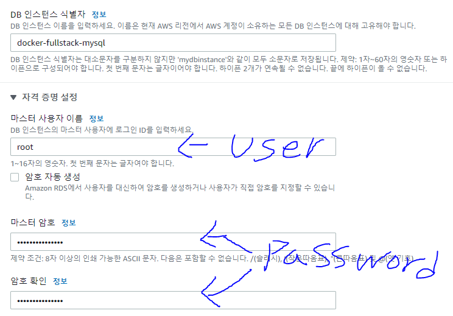
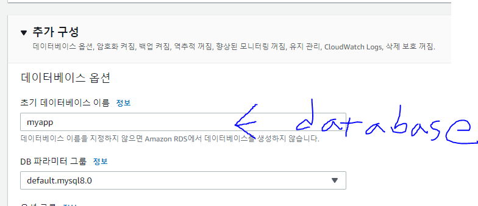
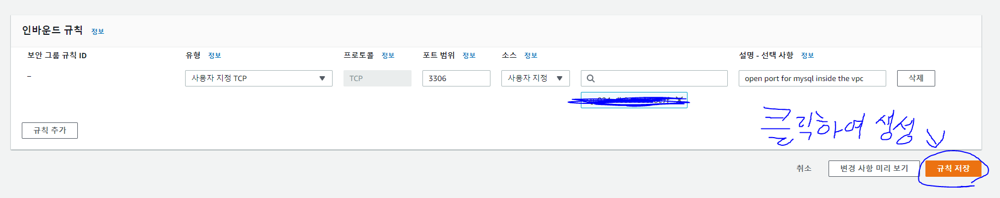
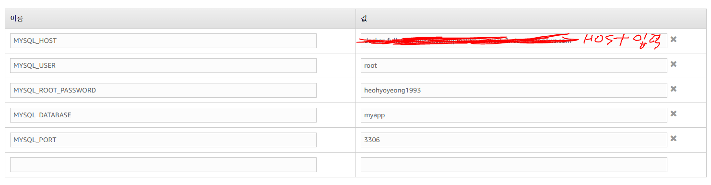

# Docker-Fullstack-App 코드작성 순서

## 1. Node.js 코드작성

- 가장 처음 backend 폴더를 생성한 후 cd backend하여 폴더 진입
- terminal에서 npm init을 사용하여 package.json 파일 생성 후 변경

~~~json
기본내용에 아래 내용을 추가
  "scripts": {
    "test": "echo \"Error: no test specified\" && exit 1",
    "start": "node server.js",
    "dev": "nodemon server.js"
  }
  "dependencies": {
    "express": "4.16.3",
    "mysql": "2.16.0",
    "nodemon": "1.18.3",
    "body-parser": "1.19.0"
  }
~~~

- 그 이후 backend 폴더에 Server.js 파일 생성 

~~~js
    // 필요한 모듈들을 가져오기
    const express = require("express")
    const bodyParser = require('body-parser')

    // Express 서버 생성
    const app = express();

    // json 형태로 오는 요청의 본문을 해석해줄수있게 등록
    app.use(bodyParser.json());

    app.listen(5000, ()=>{
        console.log("어플리케이션이 5000번 포트에서 시작되었습니다.");
    })
~~~

- 그 이후 backend 폴더에 db.js 파일을 생성
~~~js
    const mysql = require("mysql");
    const pool = mysql.createPool({
        connectionLimit: 10,
        host: 'mysql',
        user: 'root',
        password: 'hhy',
        database: 'myapp'
    });

    exports.pool = pool;
~~~

- db.js 파일을 작성후 server.js에 db에 대한 내용 추가
~~~js
    // export된 pool을 시작점인 server.js에서 불러오기
    const db = require('./db');

    //DB lists 테이블에 있는 모든 데이터를 프론트 서버에 보내주기
    app.get('/api/values',function(req,res) {
        // DB 데이터베이스에서 모든 정보 가져오기
        db.pool.query('SELECT * FROM lists;',
        (err, results, fileds) => {
            //만약 에러면 상태 500을 보내고
            if (err)
                return res.status(500).send(err)
            else
            // 아니면 결과물을 가져와라
                return res.json(results)
        })
    })

    // 클라이언트에서 입력한 값을 데이터 베이스 lists 테이블에 넣어주기
    app.post('/api/value', function(req,res,next){
        // 데이터베이스에 값을 넣어주기 (body를 가져올수있는 이유는 3번재 줄의 bodyparser를 호출해오기 때문)
        db.pool.query(`INSERT INTO lists (value) VALUES("${req.body.value}")`,
        (err,results,fileds) =>{
            if(err)
                //만약 에러면 상태 500을 보내고
                return res.status(500).send(err)
            else
                //아니면 결과물을 lists에 넣어라
                return res.json({ success: true, value: req.body.value })
        })
    })

    // 작업할 내용을 작성한 후 이러한 작업이 진행될 테이블 생성 코드 작성 하기
    // id는 인트로 생성되며 자동으로 1씩 증가
    // 값은 text로 저장
    // 작됭되면 콘솔에 결과를 출력
    db.pool.query(`CREATE TABLE lists(
        id INTEGER AUTO_INCREMENT,
        value TEXT,
        PRIMARY KEY (id)
    )`, (err, results, fileds)=>{
        console.log('results', results)
    })
~~~

## 2. React.js 코드작성

- terminal에서 "npx create-react-app frontend" 라는 명령어를 작성하면 자동으로 frontend라는 폴더가 생성되고 react-app이 설치된다.
- frontend/src/App.js와 frontend/src/App.css 를 내가 원하는 방식으로 수정 (코드 복사해옴)
- 그 이후 npm run start를 실행하면 작동하면 실행이 되나 코드 변경시 반영이 되지 않음 (원도우에서만 이러는 것으로 파악)
- 위의 문제는 frontend/package.json에서 수정하면 가능 (https://stackoverflow.com/questions/71297042/react-hot-reload-doesnt-work-in-docker-container 참조)

~~~json
기존 코드에서
  "scripts": {
    "start": "react-scripts start",
    "build": "react-scripts build",
    "test": "react-scripts test",
    "eject": "react-scripts eject"
  }
   
  "scripts": {
    "start": "WATCHPACK_POLLING=true react-scripts start", <= 이부분을 수정하면 리엑트 핫로드 수행가능
    "build": "react-scripts build",
    "test": "react-scripts test",
    "eject": "react-scripts eject"
  },
~~~

## 3. React app을 위한 frontend 도커파일 작성

- frontend에서 사용할 도커파일들을 작성해주어야한다.
- 개발용 Dockerfile.dev과 운영을 위한 Dockerfile을 작성해야한다.
- Dockerfile은 평범하지만 Dockerfile.dev는 조금 다르다.
~~~
    FROM nginx
    EXPOSE 3000

    // 이게 밑에있는 nginx의 설정파일의 위치이며 COPY를 통해 기본파일을 우리가 작성한것으로 덮어쓰기하는것
    COPY ./nginx/default.conf /etc/nginx/conf.d/default.conf 

    // build 파일들을 nginx가 가리키고 있는 경로로 보내라!
    COPY --from=builder /app/build /usr/share/nginx/html
~~~

- frontend에서 사용할 nginx에 대한 설정
~~~
    nginx의 default conf 설명
    server{

        listen 3000; => nginx 서버가 3000번 포트를 받기때문에 작성

        location / <= location/로 갈때 작동한다!

            root /usr/share/nginx/html;  => HTML 파일이 위치할 루트 설정 (Nginx가 생성한 Build 파일들의 위치)
            
            index index.html index.htm;  => 사이트의 index 페이지로 할 파일명 설정
 
            try_files $uri #uri/ /index.html; => React Router를 사용해서 페이지간 이동을 할 떄 이 부분이 필요 (이 부분이 없으면 페이지 이동이 불가능)
        }
    }
~~~

## 4. Node app을 위한 backend 도커파일 작성

- backend에서 사용할 도커파일들을 작성해주어야한다.
- 개발용 Dockerfile.dev과 운영을 위한 Dockerfile을 작성해야한다.
- Dockerfile은 평범하지만 Dockerfile.dev는 조금 다르다.
~~~
    FROM node:alpine

    WORKDIR /app

    COPY ./package.json ./

    RUN npm install

    COPY . .
    
    // package.json에서  코드가 변경될 때 바로 반영해주는 nodemon이라는 모듈을 사용해기 위하여 dev로 사용
    // package.json => "dev": "nodemon server.js"
    CMD ["npm","run","dev"]
~~~

## 5. mysql을 위한 도커파일 작성

- mysql이라는 폴더를 root 디렉토리에 생성후 Dockerfile을 생성

~~~
    // mysql 이미지를 가져와서 생성
    FROM mysql:5.7 

    // 추후 생성할 my.cnf 파일을 지금 작성할 my.cnf파일로 덮어쓰기 
    ADD ./my.cnf /etc/mysql/conf.d/my.cnf
~~~

- 그이후 my.cnf 파일 을 생성, 기본 my.cnf의 경우 라틴어로 설정되어있어 한국어를 사용할 경우 깨는 현상발생
- 이러한 현상을 방지하기 위하여 utf8로 샛팅을 변경해주어야 함

~~~
    [mysqld]
    character-set-server=utf8

    [mysql]
    default-character-set=utf8

    [client]
    default-character-set=utf8
~~~

- 그이후 mysql 내부에 sqls 폴더를 생성한 후 생성한 폴더에 initialize.sql 이라는 DATABASE와 TABLE을 작성

~~~
    DROP DATABASE IF EXISTS myapp; <= 기존에 DATABASE가 있다면 myapp을 드랍하라

    CREATE DATABASE myapp; <= myapp이라는 DATABASE가 생성
    USE myapp; <= myapp이라는 DATABASE를 사용

    CREATE TABLE lists ( <= myapp이라는 DATABASE 내부에 lists라는 TABLE을 생성하는데
        id INTEGER AUTO_INCREMENT, <= id는 int 타입에 1씩 증가하며
        value TEXT, <= 값은 text 이고 
        PRIMARY KEY (id) <= PRIMARY KEY는 id이다.
    );
~~~

## 6. NGINX를 위한 도커파일 작성 (연결 주소에 따라 fronted와 backend를 구분해줄수있는 기능)

- nginx이라는 폴더를 root 디렉토리에 생성후 Dockerfile과 default.conf을 생성
- 개발용 Dockerfile.dev와 배포용 Dockerfile를 따로 제작해야하지만 이 섹션의 경우 2개가 같아 하나로 통일

- default.conf 설정파일 부터 작성
~~~
    upstream frontend {
        server frontend:3000;  <= 3000 포트에서 frontend가 돌아가는 것을 명시
    }

    upstream backend {
        server backend:5000;   <= 5000 포트에서 backend가 돌아가는 것을 명시
    }

    server {
        listen 80; <= Nginx 서버 포트 80번을 열어주고 

        location / {
            proxy_pass http://frontend;  <= /로 끝나면 frontend로 보낸다는 의미이며 /api 보다 후순위 입니다.
        }

        location /api {
            proxy_pass http://backend; <= /api로 끝나면 backend로 보낸다는 의미
        }

        location /sockjs-node {  <= 이부분이 없다면 개발 환경에서 에러가 발생한다고 합니다.
            proxy_pass http://frontend;
            proxy_http_version 1.1;
            proxy_set_header Upgrade $http_upgrade;
            proxy_set_header Connection "Upgrade";
        }

    }
~~~

- Nginx를 구동하기 위한 Dockerfile을 생성

~~~
    // nginx 베이스 이미지를 가져와서 생성
    FROM nginx

    // 추후 생성할 my.cnf 파일을 지금 작성할 my.cnf파일로 덮어쓰기 
    COPY ./default.conf  /etc/nginx/conf.d/default.conf

~~~

## 7. Docker-compose를 사용하기 위한 Docker-compose.yml 파일 작성

- Docker-compose.yml를 작성하여 제작할 Container에 대하여 dockerfile과 설정에 대한 명시 수행
- Docker-compose.yml를 작성한 후 Docker-compose up 명령어를 사용하면 localhost:3000에서 react-app이 켜지지만 아무리 입력을 진행해도 data가 뜨지 않을 것이다.
- 그 이유는 mysql에 대하여 명시를 해주었지만 정상 mysql의 설치를 진행하지 않았기 때문! 

~~~
    version: "3"
    services:
        frontend:
            build:
                dockerfile: Dockerfile.dev
                context: ./frontend
            volumes:
                - /app/node_modules
                - ./frontend:/app
            stdin_open: true

    nginx: 
        restart: always
        build:
            dockerfile: Dockerfile
            context: ./nginx
        ports: 
            - "3000:80"

    backend:
        build: 
            dockerfile: Dockerfile.dev
            context: ./backend
        container_name: app_backend
        volumes:
            - /app/node_modules
            - ./backend:/app

    mysql:
        build: ./mysql
        restart: unless-stopped
        container_name: app_mysql
        ports: 
            - "3308:3306"
        volumes:
            - ./mysql/mysql_data:/var/lib/mysql
            - ./mysql/sqls/:/docker-entrypoint-initdb.d/
        environment: 
            MYSQL_ROOT_PASSWORD: 1q2w3e4r!!
            MYSQL_DATABASE: myapp
~~~

- mysql 설치에 관한 블로그 "https://devdhjo.github.io/mysql/2020/01/28/database-mysql-001.html" 를 참조하여 mysql을 설치 
- 또한 "[error] --initialize specified but the data directory has files in it."이러한 에러가 뜬다면 "https://stackoverflow.com/questions/37644118/initializing-mysql-directory-error" 사이트를 확인

## 8. AWS에서 도커를 작동시키기 위한 MYSQL관련 부분 정리 작업

- 7까지는 Mysql을 내부 서버에서 작동시켰다면 이제는 AWS에서 작동시키기 위한 코드를 수정해 주어야한다.

~~~
    Docker-compose.yml 파일의 이 부분을 전부 주석처리 진행

    # mysql:
    #     build: ./mysql
    #     restart: unless-stopped
    #     container_name: app_mysql
    #     ports: 
    #         - "3308:3306"
    #     volumes:
    #         - ./mysql/mysql_data:/var/lib/mysql
    #         - ./mysql/sqls/:/docker-entrypoint-initdb.d/
    #     environment: 
    #     MYSQL_ROOT_PASSWORD: 1q2w3e4r!!
    #     MYSQL_DATABASE: myapp

    이렇게 주석처리 수행
~~~

- 또한 추후 aws에서 db생성후 작성할 내용을 backend의 db.js에 기입해줄것이다 . (추후 진행 예정) 

## 9. Travis CI 를 사용하기 위한 .travis.yml 파일 작성하기

- 7까지는 Mysql을 내부 서버에서 작동시켰다면 이제는 AWS에서 작동시키기 위한 코드를 수정해 주어야한다.

~~~
    language: generic <= 언어는 genenric으로 한다 

    sudo: required <= sudo 권한이 필요하다

    services:
        - docker  <= docker로 서비스를 한다

    before_install:
        // heohyoyeong/react-test-app라는 이름으로 빌드를 할것이다
        // 빌드할 도커 파일은 ./frontend/Dockerfile.dev 이다.
        // 또한 이것의 위치는  ./frontend 입니다.
        - docker build -t heohyoyeong/react-test-app -f ./frontend/Dockerfile.dev ./frontend  

    script:
        // install 후에 -e 명령어로 CI=true라는 설정을 한후 <= CI=true는 travis CI에서 사용하기 위한 설정 (이게 없으면 오류 발생)
        // heohyoyeong/react-test-app라는 Container로 npm test를 진행한다. 
        - docker run -e CI=true heohyoyeong/react-test-app npm test

    after_success:
        - docker build -t heohyoyeong/docker-frontend ./frontend <= 각각의 이미지를 build 한다.
        - docker build -t heohyoyeong/docker-backend ./backend
        - docker build -t heohyoyeong/docker-nginx ./nginx
        
        // travis ci에서 업로드된 repo를 찾아간후 setting의 more option 클릭
        // 그이후 environment variables에 도커 허브 아이디와 비밀번호를 입력
        - echo "$DOCKER_HUB_PASSWORD" | docker login -u "$DOCKER_HUB_ID" --password-stdin <= 도커 허브에 로그인

        - docker push heohyoyeong/docker-frontend <= 빌드된 이미지를 도커 허브에 push
        - docker push heohyoyeong/docker-backend
        - docker push heohyoyeong/docker-nginx
~~~

## 10. 다중 컨터에너를 aws에 배포하기위한 Dockerrun.aws.json 작성

- Dockerrun.aws.json파일은 Docker 컨테이너 세트를 AWS의 Elastic beanstalk 어플리케이션으로 배포하는 방법을 설명하는 파일
- Dockerrun.aws.json파일을 사용하면 멀티 컨테이너 Docker 환경을 사용할 수 있습니다.

~~~json
    // 변수의 의미부터 설명 
    // name  : 컨테이너의 이름
    // image : Docker 컨테이너를 구축할 온라인 Docker 레포의 이미지명
    // hostname : 호스트 이름으로 이 이름을 사용하여 도커 컴포즈를 이용해 생성된 다른 컨테이너를 접근 가능
    // essenstial : true로 할 경우, 컨테이너가 실패하면 작업을 중지합니다. 
    //              필수적이지 않은 컨테이너는 인스턴스의 나머지 컨테이너에 영향을 미치지않고 종료되거나 충돌 할 수 있다.
    // memory : 컨테이너 용으로 예약할 인스턴스의 메모리양. 
    //          컨테이너 정의에서 memory 또는 memoryReservation 파라미터중 하나 또는 모드 0이 아닌 정수로 지정하면 됨
    // portMappings : 컨테이너에 있는 네트워크 지점을 호스트에 있는 지점에 매핑
    // links : 연결한 컨테이너의 목록. 연결된 컨테이너는 서로를 검색하고 통신 가능

    "AWSEBDockerrunVersion": 2,
    "containerDefinitions": [
        {
            "name": "frontend",
            "image": "heohyoyeong/docker-frontend",
            "hostname": "frontend",
            "essential": false,
            "memory": 128
        },
        {
            "name": "backend",
            "image": "heohyoyeong/docker-backend",
            "hostname": "backend",
            "essential": false,
            "memory": 128
        },
        {
            "name": "nginx",
            "image": "heohyoyeong/docker-nginx",
            "hostname": "nginx",
            "essential": true,
            "portMappings": [
                {
                    "hostPort": 80,
                    "containerPort": 80
                }
            ],
            "links": ["frontend", "backend"],
            "memory": 128
        }
    ]
~~~

## 12. AWS 진행

- 가장먼저 아마존 AWS Elastic beanstalk에서 새 환경 생성을 통해 환경 생성
- 환경 이름을 작성 후 플랫폼을 Docker running on 64bit Amazon Linux 2를 선택하여 Elastic beanstalk 생성 진행

- MYSQL을 위한 AWS RDS를 생성해 줄 것입니다.
- 이를 위해 Docker-compose.yml 파일과 backend의 db.js 수정할 것 입니다.

Docker-compose.yml 파일 수정
~~~
    DB와 
    backend:
        build: 
            dockerfile: Dockerfile.dev
            context: ./backend
        container_name: app_backend
        volumes:
            - /app/node_modules
            - ./backend:/app 
        // 기존에는 volumes 까지만 작성하였지만 아래의 환경을 추가로 작성 진행
        environment: 
            MYSQL_HOST: mysql
            MYSQL_USER: root 
            MYSQL_ROOT_PASSWORD: heohyoyeong1993
            MYSQL_DATABASE: myapp
            MYSQL_PORT: 3306   
~~~

db.js 파일 수정
~~~
    db.js의 경우 기존에는 host와 USER등을 명시하여 작성하였습니다.
    
    const mysql = require("mysql");
    const pool = mysql.createPool({
        connectionLimit: 10,
        host: 'mysql',
        user: 'root',
        password: '1q2w3e4r!!',
        database: 'myapp'
    });
    exports.pool = pool;
    
    이제는 Docker-compose로부터 정보를 받아오도록 host와 user 등을 변경합니다.

    const mysql = require("mysql");
    const pool = mysql.createPool({
        connectionLimit: 10,
        host: process.env.MYSQL_HOST,
        user: process.env.MYSQL_USER,
        password: process.env.MYSQL_ROOT_PASSWORD,
        database: process.env.MYSQL_DATABASE,
        port: process.env.MYSQL_PORT
    });
    exports.pool = pool;
~~~

- 그이후 AWS RDW 데이터 베이스를 생성합니다.
- 엔진 옵션은 MYSQL 이고 템플릿은 프리티어로 작성합니다.

사전에 Docker-compose에서 user,password,database를 설정해 주었기 때문에 해당 내용을 RDW에 명시해주어야합니다.

- 이제 Security Group을 생성해주기 위하여 AWS의 VPC로 들어갑니다.
- VPC의 보안그룹을 클릭한 후 적당한 이름을 작성후 생성합니다.
- 그 이후 인바운드 규칙 편집을 클릭 후 규칙 추가를 클릭합니다.

- 이제 생성한 Security Group을 이전에 제작한 RDS의 데이터베이스에 적용해볼것입니다.
- 이전에 작성하였던 데이터 베이스를 들어간 후 수정버튼을 클릭합니다.
- 그 이후 보안 그룹 생성한 Security Group을 클릭하고 계속버튼을 클릭한후 즉시적용하여 데이터 베이스를 수정합니다.

- 이번에는 생성한 Security Group을 이전에 제작한 elastic beanstalk에 적용해볼것입니다.
- 이전에 작성하였던 elastic beanstalk에 들어간 후 왼쪽의 구성버튼을 클릭합니다.
- 그 이후 인스턴스의 편집을 누른후 인스턴스 보안 그룹을 작성한 Security Group를 추가한후 확인하면 됩니다.

- 이번에는 elastic beanstalk과 RDS 소통을 위한 환경변수를 설정할 것 입니다.
- 가장 먼저 이전에 생성하였던 RDS에 접근하여 Host를 복사합니다. 

- RDW에 접근하여 Host가 무었인지 확인합니다.
- 이전에 작성하였던 elastic beanstalk의 구성에서 인스턴스 편집으로 들어갑니다.
- 그 이후 환경 속성에서 이전에 Docker-compose.yml 파일에 작성하였던 내용을 기입합니다.

## 13. 배포를 위한 .travis.yml 수정

- 이제 배포를 위해서 .travis.yml 파일을 수정해 줄 것입니다.

~~~
    deploy:
        provider: elasticbeanstalk  <= elasticbeanstalk으로 실행
        region: "us-west-2"  <= elasticbeanstalk의 물리적 주소 
        app: "docker-fullstack-app" <= elasticbeanstalk의 생성한 이름
        env: "Dockerfullstackapp-env" <= elasticbeanstalk의 환경명으로 elasticbeanstalk에 들어가면 나오는 큰 이름
        bucket_name: elasticbeanstalk-us-west-2-665683613775 <= AWS의 S3에 접속하면 생성한 elasticbeanstalk에 관련된 것의 복사해오면됨
        bucket_path: "docker-fullstack-app"
        on:
            branch: master <= master branch에 push가 될 때마다 최신화 하겟다.
        
        access_key_id: $AWS_ACCESS_KEY   <= 아무나 접속할 수 없기 때문에 id와 Password를 걸것이고 이것으로 travis ci 와 연동을 합니다.
        secret_access_key: $AWS_SECRET_ACCESS_KEY
~~~